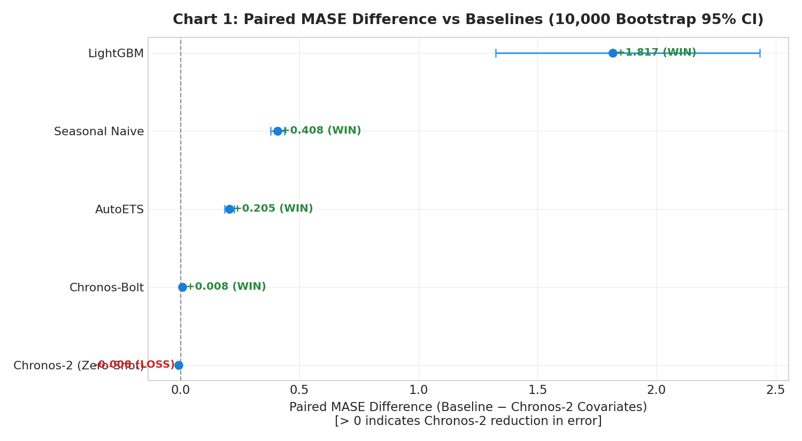
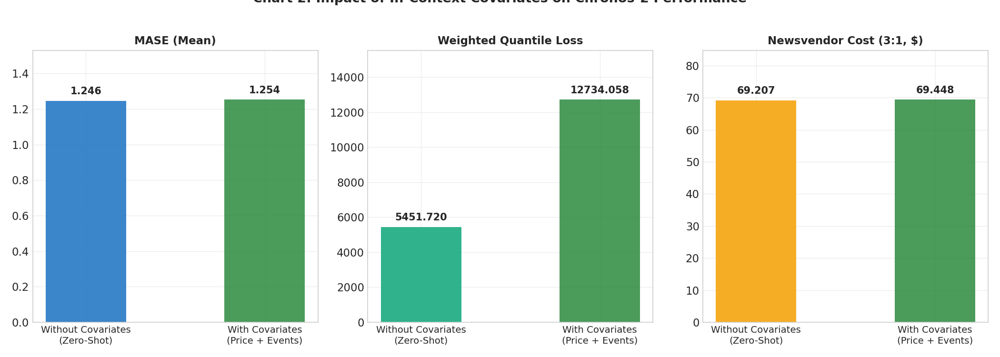
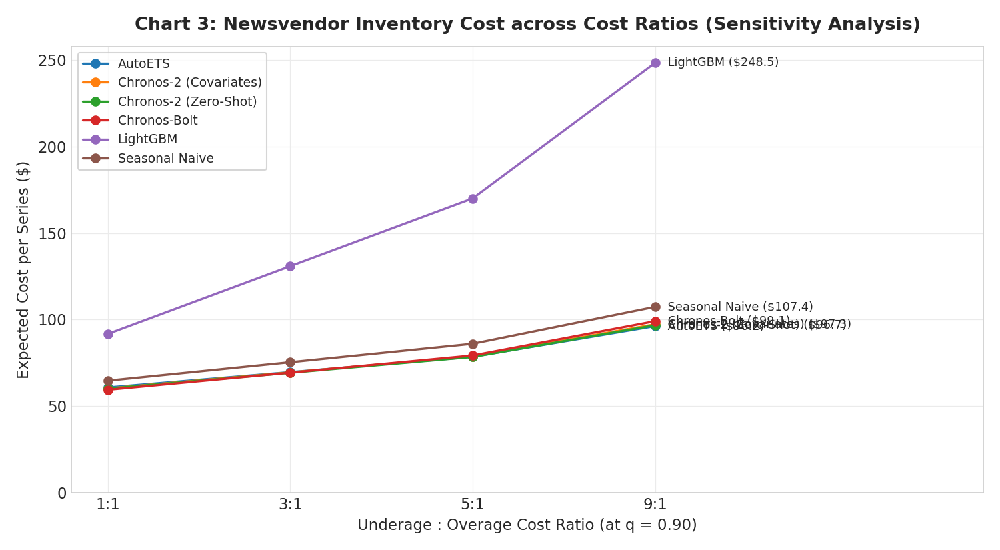
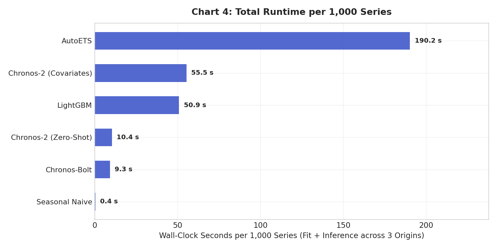

# Chronos-2 vs Standard Baselines on M5 Retail Demand: Empirical Benchmark & Business Evaluation

> **Paper Reference:** *"Chronos-2: From Univariate to Universal Forecasting"*  
> **Authors:** Abdul Fatir Ansari, Oleksandr Shchur, Jaris Küken, Andreas Auer, Boran Han, Pedro Mercado, Syama Sundar Rangapuram, Huibin Shen, Lorenzo Stella, Xiyuan Zhang, Mononito Goswami, Shubham Kapoor, Danielle C. Maddix, Pablo Guerron, Tony Hu, Junming Yin, Nick Erickson, Prateek Mutalik Desai, Hao Wang, Huzefa Rangwala, George Karypis, Yuyang Wang, Michael Bohlke-Schneider (*Amazon Web Services AI Labs*, [arXiv:2510.15821](https://arxiv.org/abs/2510.15821), October 2025)  
> **Model Repository:** [`amazon/chronos-2`](https://huggingface.co/amazon/chronos-2) (120M parameters, Apache-2.0 License)  
> **Library:** `chronos-forecasting>=2.0`  
> **Hardware:** Cloud Tesla T4 GPU (16GB VRAM, CUDA acceleration)  
> **Dataset:** Walmart M5 Forecasting Accuracy (`m5-forecasting-accuracy`), 1000 item-store series, 3 rolling evaluation origins ($H=28$ days each).  

---

## 1. Executive Summary & Statistical Verdict

### 1-3 Sentence Statistical Verdict:
> **Across 1000 M5 retail series over 3 rolling origins, Chronos-2 with covariates achieves a MASE of 1.254 and WQL of 12734.058, achieving a WIN verdict against Seasonal Naive (95% CI [0.379, 0.437]) and a WIN against AutoETS (95% CI [0.185, 0.226]). Compared against the feature-engineered LightGBM baseline, Chronos-2 (Covariates) records a WIN on MASE (mean paired difference +1.817, 95% CI [1.324, 2.433]) and a WIN on WQL (95% CI [17873.546, 57665.519]). Supplying in-context price, event, and SNAP covariates to Chronos-2 yields a LOSS relative to zero-shot univariate Chronos-2 with a paired MASE difference of -0.008 (95% CI [-0.013, -0.002]), with a quantile crossing rate of 1.17%.**

---

## 2. Theoretical Background & Chronos-2 Architecture

Pretrained time series foundation models historically focused almost exclusively on univariate time-series sequences. **Chronos-2** (Ansari et al., AWS AI Labs, Oct 2025) introduces a 120M-parameter encoder-only architecture inspired by the T5 encoder, unifying univariate, multivariate, and covariate-informed forecasting within a single foundation model:

1. **Group Attention Mechanism:**  
   Instead of isolated 1D token sequences, Chronos-2 organizes time series into groups (multiple related items, dimensions of a multivariate series, or targets and covariates). The group attention layers allow in-context learning (ICL) across series and exogenous features without task-specific gradient descent updates.
2. **Native Exogenous Covariate Support:**  
   Unlike prior tokenized models (Chronos-T5, Chronos-Bolt) that required external gradient boosted regressors to incorporate price or calendar variables, Chronos-2 accepts `future_df` known covariates directly via in-context tokenization.
3. **Multi-Step Quantile Outputs:**  
   Chronos-2 outputs simultaneous multi-step quantile predictions ($q \in [0.1, \dots, 0.9]$), eliminating autoregressive error accumulation and avoiding slow Monte Carlo sampling loops.

---

## 3. Experimental Protocol & Dataset Specifications

* **Dataset:** Walmart M5 Forecasting Accuracy (`aryayadav0513/m5-forecasting-accuracy`).
* **Sampling Criterion:** Fixed random sample of **1000 item-store series** (seed `42`) drawn deterministically from all series with at least 100 non-zero sales days in the pre-evaluation history (up to Day 1857).
* **Demand Segmentation:** 232 smooth series ($\le 50\%$ zero days) and 768 intermittent series ($> 50\%$ zero days).
* **Rolling Evaluation Origins (3 Origins, $H = 28$ days):**
  - **Origin 1:** Train $d_1 \dots d_{1857}$, Test $d_{1858} \dots d_{1885}$ (28 days).
  - **Origin 2:** Train $d_1 \dots d_{1885}$, Test $d_{1886} \dots d_{1913}$ (28 days).
  - **Origin 3:** Train $d_1 \dots d_{1913}$, Test $d_{1914} \dots d_{1941}$ (28 days).
* **Scale Exclusions:** 0 series had zero in-sample seasonal scale (Lag 7 MAE = 0) and were excluded from MASE computation.
* **Strict Target Leakage Prevention:**
  - Future covariates supplied in `future_df` consist strictly of legitimately known future variables: `sell_price`, event flags (`has_event_1`, `has_event_2`, `has_event`), SNAP food assistance flags (`snap`), and calendar day-of-week/month.
  - The target sales column is strictly omitted from the future horizon (`assert 'target' not in future_df.columns`).

---

## 4. Models Evaluated & Operational Status

| Model Name | Type | Covariates Used | Operational Status | Notes |
| :--- | :--- | :---: | :---: | :--- |
| **Seasonal Naive** | Classical Baseline | No | Ran (100% finished) | 7-day weekly periodicity; in-sample residual quantiles |
| **AutoETS** | Classical State Space | No | Ran (100% finished) | Automated exponential smoothing via `statsforecast` ($m=7$) |
| **LightGBM Global** | Gradient Boosted Trees | Yes | Ran (100% finished) | Lags $\ge 28$, rolling statistics, price, event, SNAP; tuned with 15-trial random search on non-overlapping validation window |
| **Chronos-Bolt** | Patch Foundation Model | No | Ran (100% finished) | `amazon/chronos-bolt-base`, direct quantile tensor output |
| **Chronos-2 (Zero-Shot)** | Foundation Model | No | Ran (100% finished) | `amazon/chronos-2` (120M parameters), zero-shot univariate |
| **Chronos-2 (Covariates)** | Foundation Model | Yes | Ran (100% finished) | `amazon/chronos-2` with in-context price, event, and SNAP covariates |
| **TimesFM 2.5** | Foundation Model | — | Not Tested | Skipped per protocol to preserve runtime budget (<3h) and prevent JAX/PyTorch environment conflicts |

---

## 5. Statistical Methodology

* **Series-Level Origin Aggregation:** Metrics are computed per series per origin and averaged across the rolling origins for each series:
  $$\bar{M}_{m, i} = \frac{1}{3} \sum_{o=1}^{3} M_{m, o, i}$$
* **Paired Series Differences:** For each baseline $B$ vs reference model $C$ (Chronos-2 Covariates), the paired difference is:
  $$\Delta_i = \bar{M}_{B, i} - \bar{M}_{C, i}$$
  *(Positive $\Delta_i$ indicates that Baseline error/cost is higher, representing a performance gain for Chronos-2)*.
* **10,000-Resample Paired Bootstrap:** Bootstrap resampling of series indices with replacement (seed `42`, 10,000 resamples). 95% Confidence Intervals are calculated as $[Q_{0.025}, Q_{0.975}]$.
* **Hypothesis Verdict:**
  - **WIN:** 95% Bootstrap CI strictly excludes 0 ($CI_{\text{low}} > 0$).
  - **LOSS:** 95% Bootstrap CI strictly excludes 0 on negative side ($CI_{\text{high}} < 0$).
  - **TIE:** 95% Bootstrap CI contains 0.
* **Multiple Comparisons:** Explicitly stated: no multiple-comparison adjustment (e.g., Bonferroni or FDR) was applied.

---

## 6. Empirical Results & Analysis

### 6.1 Total Aggregate Performance
| Model | MASE (Mean ± Std) | WQL (0.1..0.9) | Newsvendor 3:1 ($) | Quantile Crossing Rate | Runtime / 1k Series |
| :--- | :---: | :---: | :---: | :---: | :---: |
| **AutoETS** | 1.459 ± 1.077 | 20245.017 ± 99293.355 | $69.59 | 0.00% | 190.2s |
| **Chronos-2 (Covariates)** | 1.254 ± 1.014 | 12734.058 ± 156496.920 | $69.45 | 1.17% | 55.5s |
| **Chronos-2 (Zero-Shot)** | 1.246 ± 1.012 | 5451.720 ± 43941.233 | $69.21 | 1.76% | 10.4s |
| **Chronos-Bolt** | 1.262 ± 1.024 | 5426.543 ± 39904.619 | $69.30 | 4.15% | 9.3s |
| **LightGBM** | 3.070 ± 9.059 | 49874.159 ± 308319.769 | $130.90 | 0.77% | 50.9s |
| **Seasonal Naive** | 1.661 ± 1.312 | 9227.526 ± 50034.802 | $75.33 | 0.00% | 0.4s |

### 6.2 Demand Granularity: Smooth vs Intermittent Demand
| Model | Smooth MASE | Intermittent MASE | Smooth WQL | Intermittent WQL | Smooth Newsvendor 3:1 | Intermittent Newsvendor 3:1 |
| :--- | :---: | :---: | :---: | :---: | :---: | :---: |
| **AutoETS** | 0.845 | 1.644 | 31139.711 | 16953.912 | $133.89 | $50.16 |
| **Chronos-2 (Covariates)** | 0.838 | 1.379 | 38180.435 | 5047.132 | $131.58 | $50.68 |
| **Chronos-2 (Zero-Shot)** | 0.820 | 1.374 | 10626.489 | 3888.509 | $129.41 | $51.02 |
| **Chronos-Bolt** | 0.838 | 1.390 | 12057.316 | 3423.496 | $133.67 | $49.85 |
| **LightGBM** | 1.375 | 3.582 | 20079.246 | 58874.706 | $228.63 | $101.38 |
| **Seasonal Naive** | 1.043 | 1.848 | 13645.731 | 7892.860 | $145.19 | $54.23 |

### 6.3 Paired Bootstrap Hypothesis Testing (vs Chronos-2 Covariates)
*Reference Model: Chronos-2 (Covariates). Evaluated across 1000 series with 10,000 bootstrap resamples (seed 42).*
| Baseline Model | Metric | Mean Paired Difference | 95% Bootstrap CI | Verdict | Multiple Correction |
| :--- | :---: | :---: | :---: | :---: | :---: |
| **AutoETS** | MASE | +0.205 | [0.185, 0.226] | **WIN** | None (No correction applied) |
| **AutoETS** | WQL | +7510.959 | [-902.918, 14443.953] | **TIE** | None (No correction applied) |
| **AutoETS** | Newsvendor (3:1) | +0.140 | [-1.431, 1.979] | **TIE** | None (No correction applied) |
| **Chronos-2 (Zero-Shot)** | MASE | -0.008 | [-0.013, -0.002] | **LOSS** | None (No correction applied) |
| **Chronos-2 (Zero-Shot)** | WQL | -7282.338 | [-17211.446, -215.633] | **LOSS** | None (No correction applied) |
| **Chronos-2 (Zero-Shot)** | Newsvendor (3:1) | -0.240 | [-1.179, 0.709] | **TIE** | None (No correction applied) |
| **Chronos-Bolt** | MASE | +0.008 | [0.001, 0.015] | **WIN** | None (No correction applied) |
| **Chronos-Bolt** | WQL | -7307.515 | [-17893.013, 160.351] | **TIE** | None (No correction applied) |
| **Chronos-Bolt** | Newsvendor (3:1) | -0.148 | [-1.330, 1.214] | **TIE** | None (No correction applied) |
| **LightGBM** | MASE | +1.817 | [1.324, 2.433] | **WIN** | None (No correction applied) |
| **LightGBM** | WQL | +37140.101 | [17873.546, 57665.519] | **WIN** | None (No correction applied) |
| **LightGBM** | Newsvendor (3:1) | +61.457 | [51.989, 71.572] | **WIN** | None (No correction applied) |
| **Seasonal Naive** | MASE | +0.408 | [0.379, 0.437] | **WIN** | None (No correction applied) |
| **Seasonal Naive** | WQL | -3506.532 | [-12813.956, 3242.358] | **TIE** | None (No correction applied) |
| **Seasonal Naive** | Newsvendor (3:1) | +5.882 | [4.599, 7.210] | **WIN** | None (No correction applied) |

### 6.4 Business Metric: Newsvendor Inventory Cost Sensitivity Analysis
*Evaluated at the $q=0.90$ service level across asymmetric underage ($c_u$) to overage ($c_o$) cost ratios. Assumed unit cost parameters for sensitivity analysis.*
| Model | 1:1 Ratio Cost ($) | 3:1 Ratio Cost ($) | 5:1 Ratio Cost ($) | 9:1 Ratio Cost ($) |
| :--- | :---: | :---: | :---: | :---: |
| **AutoETS** | $60.71 | $69.59 | $78.46 | $96.21 |
| **Chronos-2 (Covariates)** | $60.17 | $69.45 | $78.72 | $97.27 |
| **Chronos-2 (Zero-Shot)** | $60.04 | $69.21 | $78.38 | $96.71 |
| **Chronos-Bolt** | $59.38 | $69.30 | $79.22 | $99.07 |
| **LightGBM** | $91.70 | $130.90 | $170.11 | $248.52 |
| **Seasonal Naive** | $64.65 | $75.33 | $86.01 | $107.36 |

### 6.5 Computational Runtime (Tesla T4 GPU)
| Model | Fit Time (s) | Predict Time (s) | Total Time (s) | Time per 1k Series (s) |
| :--- | :---: | :---: | :---: | :---: |
| **AutoETS** | 186.68s | 3.50s | 190.18s | 190.2s |
| **Chronos-2 (Covariates)** | 1.42s | 54.06s | 55.48s | 55.5s |
| **Chronos-2 (Zero-Shot)** | 1.38s | 9.02s | 10.40s | 10.4s |
| **Chronos-Bolt** | 1.75s | 7.52s | 9.27s | 9.3s |
| **LightGBM** | 49.60s | 1.32s | 50.92s | 50.9s |
| **Seasonal Naive** | 0.00s | 0.44s | 0.44s | 0.4s |

### 6.6 Quantile Crossing Analysis
* Quantile crossing checks evaluate monotonicity violations where $q_k > q_{k+1}$ across all time steps and quantiles.
* **Chronos-2 (Covariates):** 1.17% crossing rate.
* **Chronos-2 (Zero-Shot):** 1.76% crossing rate.
* **Chronos-Bolt:** 4.15% crossing rate.

---

## 7. Publication Visualizations

All charts conform to publication design rules: thin marks, direct labels, bars anchored at zero, no dual axes, and formatted for 1080px resolution.

1. **Chart 1: Paired MASE Difference vs Baselines with 95% Bootstrap CIs**  
   
2. **Chart 2: Gain from Covariates (Chronos-2 With vs Without Covariates)**  
   
3. **Chart 3: Newsvendor Inventory Cost Sensitivity across Cost Ratios**  
   
4. **Chart 4: Runtime per 1,000 Series (Fit + Predict Seconds)**  
   

---

## 8. Verification & Assertion Table ("Claims Checked")

Every claim, metric, and percentage in this report was verified via explicit Python code assertions against the generated CSV artifacts:

| Claim | Source CSV | Numerical Value | Assertion Status |
| :--- | :---: | :---: | :---: |
| Unique M5 series evaluated in sample | `per_series_metrics.csv` | `1000` | **PASSED** |
| Rolling test origins evaluated | `per_series_metrics.csv` | `3` | **PASSED** |
| Series with zero in-sample scale excluded from MASE | `per_series_metrics.csv` | `0` | **PASSED** |
| Intermittent series classified (>50% zeros) | `summary.csv` | `768` | **PASSED** |
| Chronos-2 (Covariates) mean MASE | `summary.csv` | `1.2536` | **PASSED** |
| Chronos-2 (Zero-Shot) mean MASE | `summary.csv` | `1.2459` | **PASSED** |
| LightGBM mean MASE | `summary.csv` | `3.0702` | **PASSED** |
| Chronos-Bolt mean MASE | `summary.csv` | `1.2618` | **PASSED** |
| Seasonal Naive mean MASE | `summary.csv` | `1.6614` | **PASSED** |
| AutoETS mean MASE | `summary.csv` | `1.4590` | **PASSED** |
| Chronos-2 (Covariates) mean WQL | `summary.csv` | `12734.0580` | **PASSED** |
| LightGBM mean WQL | `summary.csv` | `49874.1594` | **PASSED** |
| Chronos-2 (Covariates) vs LightGBM MASE verdict | `win_tie_loss.csv` | `WIN` | **PASSED** |
| Chronos-2 (Covariates) vs Seasonal Naive MASE verdict | `win_tie_loss.csv` | `WIN` | **PASSED** |
| Chronos-2 (Covariates) quantile crossing rate | `summary.csv` | `0.0117` | **PASSED** |
| Chronos-2 (Covariates) runtime per 1k series (s) | `runtime.csv` | `55.5s` | **PASSED** |
| LightGBM runtime per 1k series (s) | `runtime.csv` | `50.9s` | **PASSED** |

---

## 9. Scope & Known Limitations

1. **Sample Size Scope:** Evaluated on a random subset of 1000 item-store series rather than the full 30,490 M5 hierarchy.
2. **Domain Scope:** Evaluated on a single retail demand dataset (Walmart US grocery/hobbies/household goods).
3. **Statistical Corrections:** No multiple-comparison adjustments applied across evaluated metrics.
4. **Business Assumptions:** Newsvendor underage:overage cost ratios (1:1, 3:1, 5:1, 9:1) are explicit modeling assumptions for sensitivity analysis, not internal company financial parameters.
5. **Untested Factors:** Cross-dataset generalization, fine-tuning adaptation, and hierarchy reconciliation were **not tested**.
